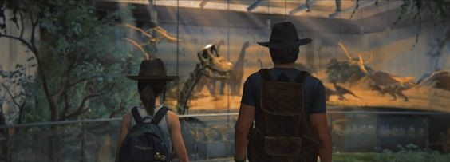
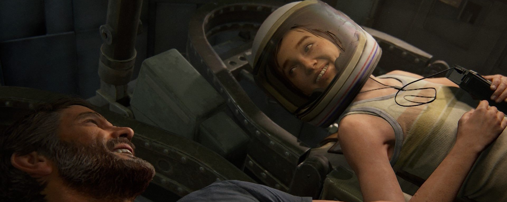
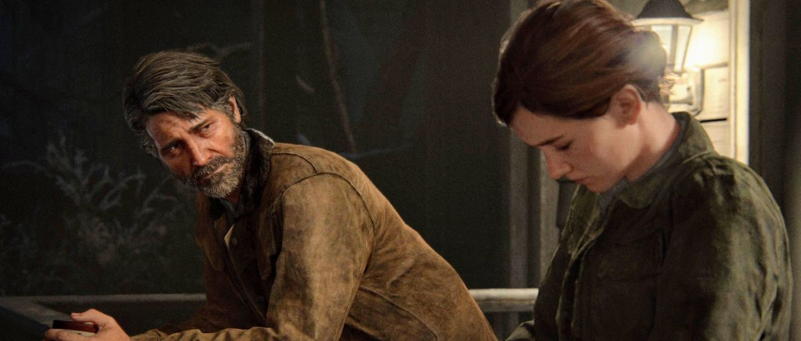
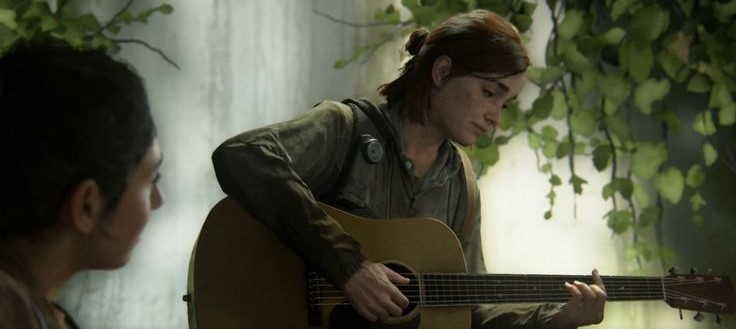

    <h1>The universe of The Last of Us </h1>
    <a href="/TheLastofUs/fr/scenes.html" style="color: white; text-decoration: none; font-weight: bold;">FR</a>

[Home](index.md) | [Video Games](jeuxvideo.md) | [TV Serie](serie.md) | [Characters](personnages.md) | [Scenes](scenes.md) | [Awards](prix.md)

---

# Favorite Scenes

## The video game The Last of Us Part II is by far my favorite, and as a result, most of the scenes shown below are taken from this second installment.

1. My favorite scene of all installments combined is Ellie’s birthday, celebrated in a museum where dinosaur fossils can be seen, as well as exhibits related to space exploration — two themes that Ellie deeply loves.

2. Also in this second installment, one of my favorite scenes is a moving conversation between Ellie and Joel.

3. Unsurprisingly, also taken from The Last of Us Part II: Ellie playing the guitar for her girlfriend, Dina.

