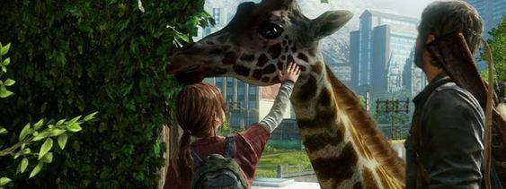

    <h1>L'univers de The Last of Us </h1>

[Accueil](index.md) | [Jeux Vidéo](jeuxvideo.md) | [Série](serie.md) | [Personnages](personnages.md) | [Scènes](scenes.md) | [Prix](prix.md)

---

# _The Last of Us_ : les jeux vidéo

Le format originale de cet univers est le jeu vidéo. L'univers a été créé et travaillé par Neil Druckmann et le studio **Naughty Dog** afin d'être vécu et raconté en jeu immersif. 

## _The Last of Us_ (2013)
Premier volume de cette franchise, nous suivons Joel Miller, un homme ayant tout perdu lors de l'apocalypse et étant maintenant devenu un contrebandier afin de survivre. 
Il doit cette fois traverser les Etats-Unis afin de livrer sa marchandise. Une marchandise particulière, qui n'est autre qu'une mystérieuse jeune fille, Ellie Williams. Tous deux traversent ensembles les états et surmontent les épreuves s'élevant devant eux tout en se rapprochant afin d'établir un lien presque familial.

>Ce premier volume est centré autour de l'amour et des relations humaines, notamment entre nos deux protagonistes.

## _The Last of Us Part II_ (2020)
Sans trop en dire, ce second volume est la suite directe du premier et suit cette fois une Ellie Williams adulte, deuteragoniste du premier volume. Cette dernière doit faire face à un nouvel ennemi et traverse le pays pour le retrouver. 

>Certaines personnes estiment que ce second volume est centré autour du cycle de la vengeance mais j'estime personnellement qu'il est centré autour des regrets et de l'acceptation de ces derniers.
