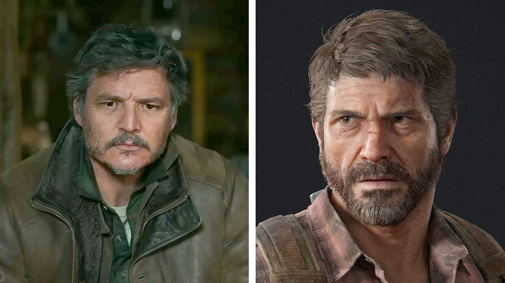
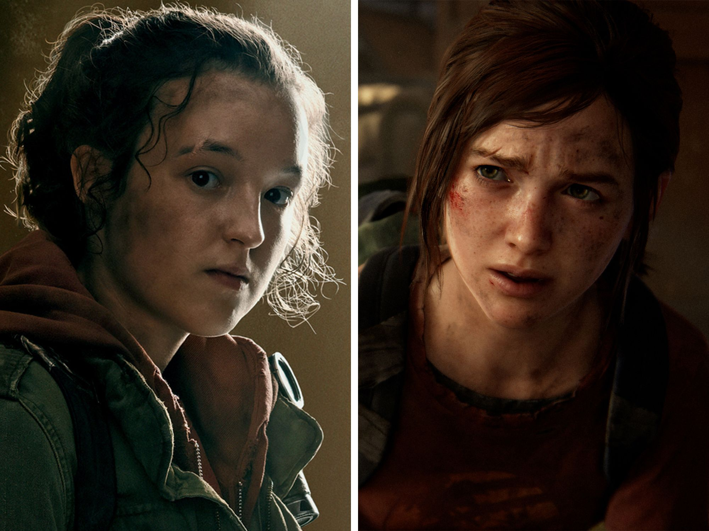
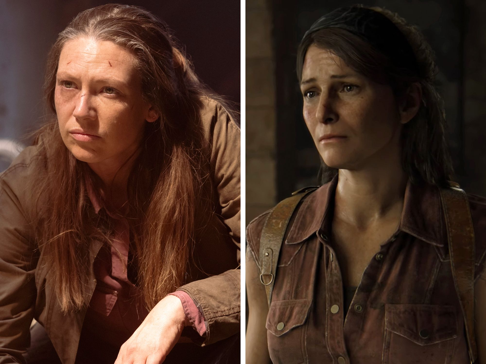
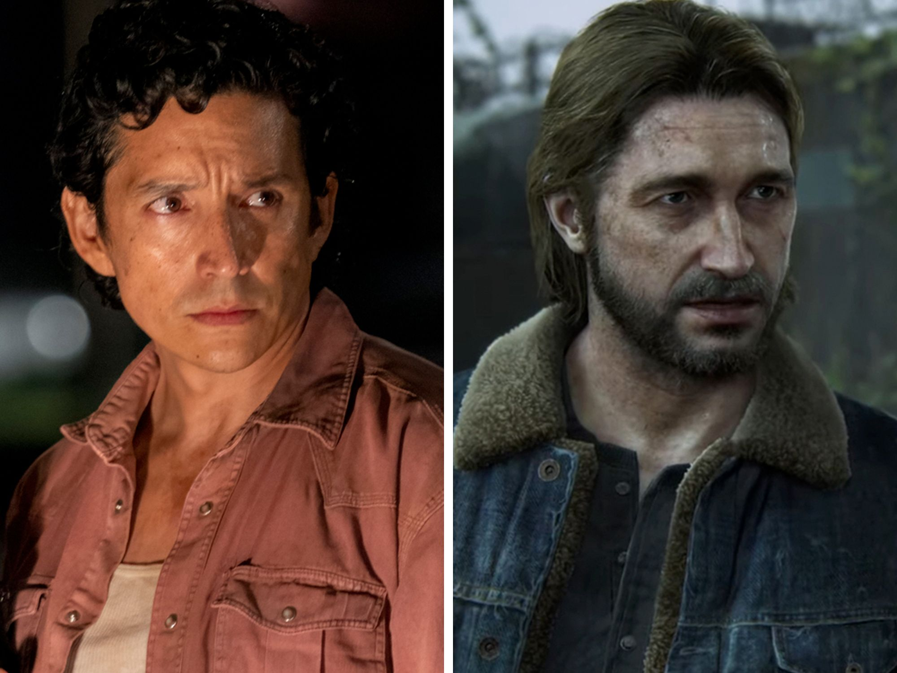
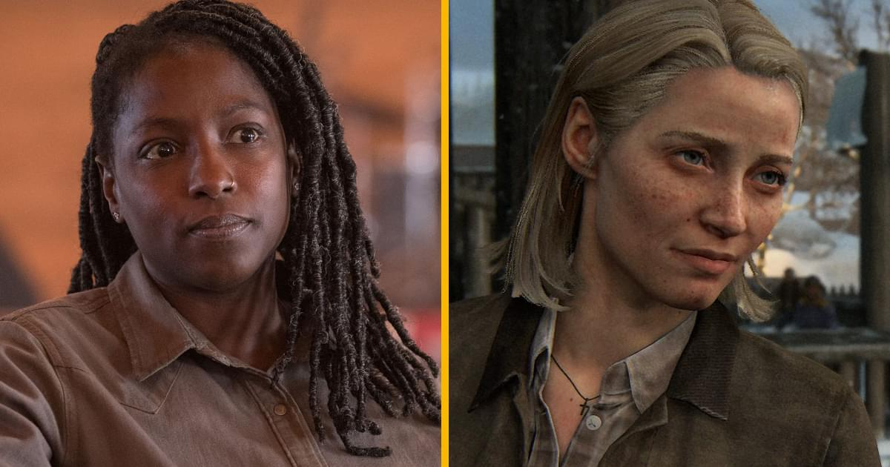
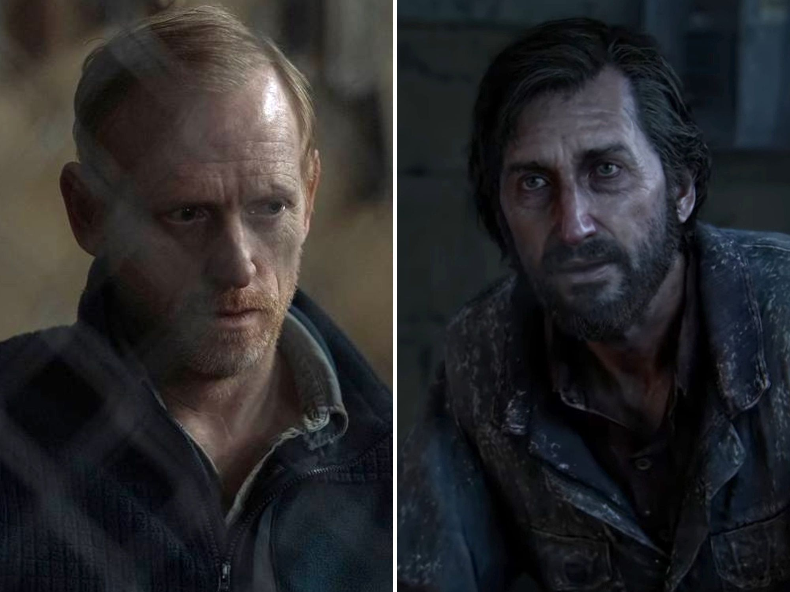

    <h1>L'univers de The Last of Us </h1>

[Accueil](index.md) | [Jeux Vidéo](jeuxvideo.md) | [Série](serie.md) | [Personnages](personnages.md) | [Scènes](scenes.md) | [Prix](prix.md)

---

# Les personnages: Série VS Jeux vidéo

## Différences physiques entre les personnages

### Liste de personnages:

Tous les personnages suivants sont issus de *The Last of Us (2013)* car les personnages de *The Last of Us Part II* n'ont pas encore été adapté. Vous pouvez donc voir un comparatif visuel entre **la série HBO** *The Last of Us* (2023) et le **jeu vidéo** *The Last of Us Part I* (le remake modernisé et adapté aux appareils actuels de _The Last of Us_ (2013) )

### __Joel Miller__

### __Ellie Williams__

### __Tess Servopoulos__

### __Tommy Miller__

### __Maria Miller__

### __David__

